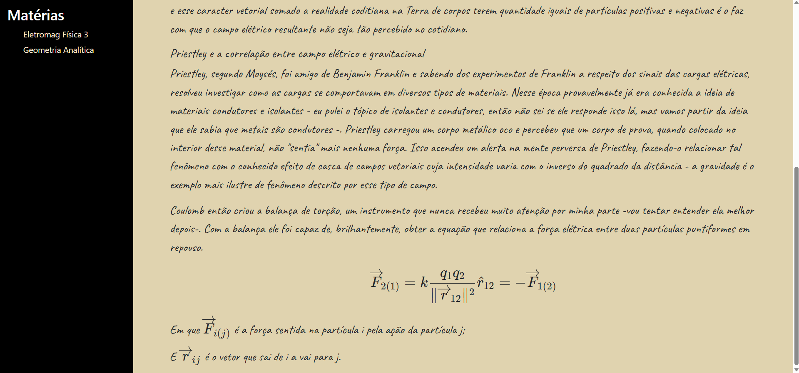

# Web page for taking notes

When finished, this project will be an html page that will allow me to write the content directly in the browser (there is, during, inside the already rendered html). It will support latex (through KaTeX) and, the most important for me, will incorporate a variation of the "curves" project, where the user will be able to generate .svg or .png of two-dimensional mathematical curves and a function of one real variable from plain tex (through a hand-made parser capable of making an AST that the "curves" can use to create the thing).

